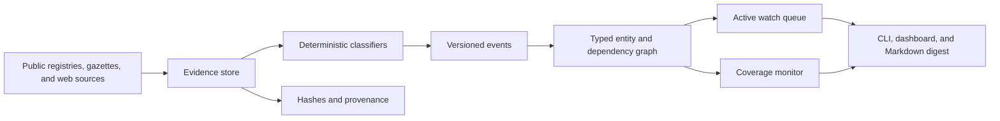

# Kassandra

[](https://github.com/Maar10Herr/Kassandra-Public/actions/workflows/ci.yml)
[](LICENSE)
[](pyproject.toml)
[](https://orcid.org/0009-0005-8721-6588)

Provenance-aware corporate monitoring that turns public records into auditable
events, dependency paths, and analyst review queues.

> [!CAUTION]
> **Experimental analyst-support software.** Kassandra is an evidence triage
> system, not a validated credit model, rating system, trading signal, or
> autonomous decision engine. Entity matches, event classifications, and graph
> transmissions require review against the underlying source material.

**[Install and run](#quick-start)** ·
**[Review the data model](docs/data_dictionary.md)** ·
**[Download the latest release](https://github.com/Maar10Herr/Kassandra-Public/releases/latest)**

## What Kassandra does

Kassandra collects public corporate material, preserves source provenance,
classifies evidence with deterministic rules, resolves legal entities, and
constructs a typed dependency graph. It produces two separate operational
queues:

| Output | Meaning | Activation rule |
|---|---|---|
| `active_watch_priority` | Adverse-evidence review priority | Requires a current direct signal or an eligible transmitted signal |
| `coverage_monitor_priority` | Source, entity, and graph-coverage work | Reflects gaps and staleness; does not represent deterioration |

This separation is enforced in the scoring layer: graph density and incomplete
coverage cannot create an adverse-watch score by themselves.

## Quick start

Using [`uv`](https://docs.astral.sh/uv/):

```sh
uv sync --extra dev
uv run kassandra --help
```

Or with a standard virtual environment:

```sh
python3 -m venv .venv
. .venv/bin/activate
python3 -m pip install -e '.[dev]'
kassandra --help
```

Initialize a disposable local workspace and run one analyst cycle:

```sh
uv run kassandra init
uv run kassandra import-portfolio
uv run kassandra resolve
uv run kassandra collect
uv run kassandra build-graph
uv run kassandra score
uv run kassandra dashboard --port 8765
```

`collect` makes network requests to configured public sources. Review the
source inventory and applicable access conditions before enabling an adapter.
Use `kassandra evidence-show ID` to inspect a record's provenance before acting
on an alert.

## System design



The implementation uses SQLite for local state and a content-addressed evidence
store for retrieved material. Each event retains its source URL, observation
time, content identity, classifier version, and reason codes. The graph records
relationship type and quality so transmitted signals remain traceable to both
an event and a path.

## Scoring contract

The current scoring layer is explainable triage rather than probability
estimation:

```text
active_watch_priority
    = adverse_signal × credibility × materiality × recency

coverage_monitor_priority
    = graph_coverage + information_gap + source_staleness
```

Only eligible evidence and relationship tiers enter watch transmission.
Unknown materiality remains explicit. Every scored record carries component
values and reason codes for review.

## Evaluation discipline

The curated distressed-company cases in `src/kassandra/benchmark.py` are
positive regression material used during rule development. They are useful for
detecting implementation regressions but do not supply a false-positive
denominator or an independent estimate of predictive performance.

[`docs/backtest_methodology.md`](docs/backtest_methodology.md) defines the
point-in-time evaluation contract for future claims. It requires:

- matched distressed and non-distressed cases;
- dated source documents and frozen collection cutoffs;
- frozen configuration, classifier, and graph identifiers; and
- a complete corpus manifest and hash.

The evaluator fails closed when those inputs are incomplete. Performance
metrics therefore enter a release only when the underlying cohort and evidence
can be audited.

## Sources and provenance

Adapters cover Companies House, the UK Gazette, GLEIF, BODACC, BORME, E-PRTR,
TED, selected public web pages and feeds, and an environment-dependent German
commercial-register path. Coverage and permitted access vary by source and
jurisdiction.

- [`docs/source_inventory.md`](docs/source_inventory.md) records each adapter's
  purpose, authoritative URL, access mode, and scheduling contract.
- [`docs/country_registry_matrix.md`](docs/country_registry_matrix.md) is a
  dated jurisdiction and availability survey.
- [`docs/data_dictionary.md`](docs/data_dictionary.md) defines provenance,
  entity, event, and score fields.

Primary services retain ownership of their records and impose their own terms.
Kassandra stores local research evidence; it does not publish a compiled source
dataset.

## Configuration and data security

Source credentials belong in a project-local `.env`, for example:

```text
COMPANIES_HOUSE_API_KEY=replace_with_your_own_key
```

The application reads explicit project configuration only. Keep `.env`,
SQLite files, evidence objects, portfolios, logs, schedules, and backups out of
version control. Use least-privilege credentials and place the dashboard behind
access controls appropriate to the environment.

This release has not received an external security audit. Treat collected
documents and analyst portfolios according to their confidentiality and
retention requirements.

## Verification

```sh
uv sync --extra dev
uv run pytest -q
uv run python -m compileall -q src tests
```

The synthetic scoring-cost benchmark exercises scaling without making a model
quality claim:

```sh
uv run python scripts/benchmark_scoring_scale.py \
  --sizes 50 500 3000 --repeats 3
```

GitHub Actions runs the test suite and syntax checks on Python 3.11 and 3.13.
Collectors are tested through deterministic fixtures rather than live services.

## Repository map

```text
src/kassandra/       package, CLI, collectors, graph, scoring, dashboard
state/migrations/    schema-only SQLite migrations
tests/               synthetic and in-memory regression and contract tests
docs/                data model, source registry, and evaluation methodology
scripts/             synthetic scoring-cost benchmark
config/              non-secret defaults
```

## Citation

Release metadata is in [`CITATION.cff`](CITATION.cff). Author:
[Maarten Linus Herrmann](https://orcid.org/0009-0005-8721-6588), ORCID
[`0009-0005-8721-6588`](https://orcid.org/0009-0005-8721-6588).

## License

Kassandra is licensed under [GPL-3.0-or-later](LICENSE), so distributed
modifications to the monitoring engine remain available under the same
reciprocal terms. Third-party libraries and public information services retain
their respective licenses and terms.
